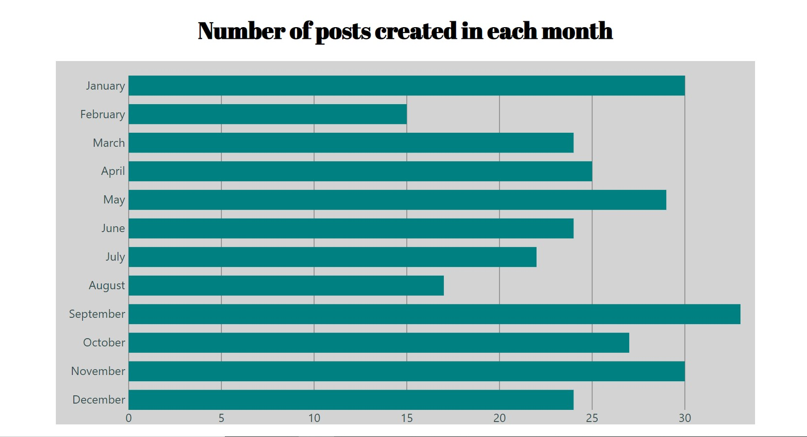

Histogram is an application witch fetches a relevantly-sized list of posts from the mock GraphQL API available at https://fakerql.goosfraba.ro/ and displays a histogram representing the number of posts created in each month of 2019.

The application is based on: React, Apollo, D3
The challenges were Apollo and D3, I never haven't worked with them.

